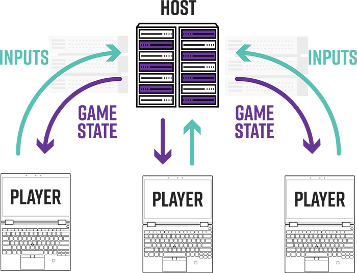
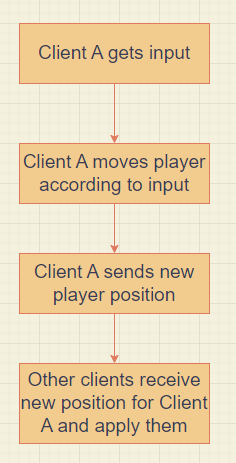

# Introduction

I’ve always wanted to try the VR gaming experience, sure there are cheap VR headsets for phones, but VR gaming on phones isn’t really a thing; most -if not all- VR mobile games are very basic and get old after 10 minutes of playing.
So I decided to build my own desktop VR headset that can run any SteamVR game on my PC, using nothing but my phone, a cheap VR headset for phones, and an Arduino along with a gyroscope sensor.

So those are the three different scenarios I could have found myself into.

My phone neither had a gyroscope sensor, nor a good display (but I ignored that because displays are expensive and would’ve need modifications in the mobile VR headset I had, or even a custom 3D printed one.)
So the plan was to build an external gyroscope sensor and somehow make it communicate with SteamVR as if it was a normal VR headset, and just use the phone as a display by using a mirroring app that displays what’s on the computer.

# Building an external gyroscope sensor: Hardware

So the hardware part was pretty straightforward, just a GY-521 gyroscope sensor breakout board based on the MPU6050 sensor hooked to an Arduino Nano, and an HC-05 Bluetooth module. I also put a toggle switch to disconnect pin 0 (Arduino) from the Bluetooth module so I could program the Arduino or for when using a USB connection. (You can’t use USB connection with pin 0 or 1 connected.)
I built the circuit and soldered it onto a PCB and hot-glued it on top of the VR headset.

As for the display I just used my phone to mirror my computer using [Spacedesk](https://www.spacedesk.net/). A better approach if I had been more serious about this would’ve been to get two (or just one) displays and mod them into the VR headset, but that would have made things much more complicated.

# Building an external gyroscope sensor: Software

Here is where it gets interesting, so the plan is to fool SteamVR into thinking our Arduino device is actually a desktop VR headset.

## Arduino Code:

First of all, I needed to program the sensor itself to just dump raw yaw, pitch, and roll data into the serial monitor, there was a built-in example that came with the MPU6050 library to do exactly that.

## [FreePIE](http://andersmalmgren.github.io/FreePIE/)

> **FreePIE** (Programmable Input Emulator) is a application for bridging and emulating input devices. It has applications primarily in video gaming but can also be used for VR interaction.

Sounds perfect, right?

Well, not really. Steam wouldn’t detect FreePIE as a VR headset as it is built to be used only for applications that support FreeTrack and OpenIR.

## [OpenVR OpenTrack](https://github.com/r57zone/OpenVR-OpenTrack)

> OpenVR / SteamVR driver allowing head tracking with any [OpenTrack](https://github.com/opentrack/opentrack) trackers, for DIY VR headset made of Android smartphone or [HDMI display](http://alii.pub/65dbii), [headset](http://alii.pub/65dct6) and tracker.

OpenVR takes in any tracker listed [here](https://github.com/opentrack/opentrack#tracking-input) and fools Steam into thinking it’s a real VR headset, and it does support FreeTrack, consecutively, supports FreePIE (which outputs a FreeTrack-supported driver.)

So here is the plan for the software side of the project:

OpenVR does support Arduino as an input tracker directly, so using FreePIE isn’t really necessary, but I would have needed to burn a custom firmware into the Arduino, which at that time I wasn’t familiar with and wasn’t ready to mess with.

# Hand Tracking

Now that I had a working desktop VR headset, I could look around in any SteamVR game, which was pretty fun by itself, but I wanted to play an actual game and all VR games required VR controllers.
The easy way would have been to use VRidge on another phone that has a gyroscope sensor, or just get an actual VR controller, or even build my own controllers using the same method as the headset. But I couldn’t do either of those things.

## [Driver4VR](https://www.driver4vr.com/)

> Body Tracking solutions for VR, Positional Tracking and controller emulation, Utilities

Driver4VR offered different solutions to emulate hand tracking without the need of building anything fancy or spending money.

## Using a Webcam

One solution was to use a webcam and track a certain color, or even better, an IR LED so other objects that have the same color don’t interfere.
I tried that and it worked pretty well but there were a couple of issues:

- For one, my arms were limited to the webcam field of view at all times.
- I could move my hands, but I couldn’t press any buttons or actually interact with anything in games.

## Using Two Mouses

Another solution - and what has worked best for me - was using two mouses, but even that had issues:

- Controlling them was a little difficult at first given that I’m using a two-dimensional input device two control a three-dimensional space in game, but it was good enough for me.
- I couldn’t look behind me and move my hands at the same time; I was basically locked in place and I had to sit.

But despite that, I was pretty happy with the results.

# Conclusion

My VR experience using the methods documented had a couple of issues:

- As mentioned, my phone display was pretty bad, it was small, had low resolution, AND it was cracked. So that really put me off.
- Surprise, surprise! Bluetooth is slow! Who would’ve thought? Definitely not 4 years ago me. So I had to use wired connection, which wasn’t actually bad, I used a long cable and it didn’t bother me at all.
- By using the MPU6050 gyroscope sensor, I could only rotate my head. It wouldn’t sense head movements.
- Couldn’t play any fast-paced games like Beat Saber because controlling hands with mouses was difficult.
- The mobile VR headset I used got uncomfortable after about 30 minutes of use, and the lenses weren’t big enough nor had the best focal length to be immersive.

But nevertheless, It was a very fun process and I learnt a ton by going through those challenges.
