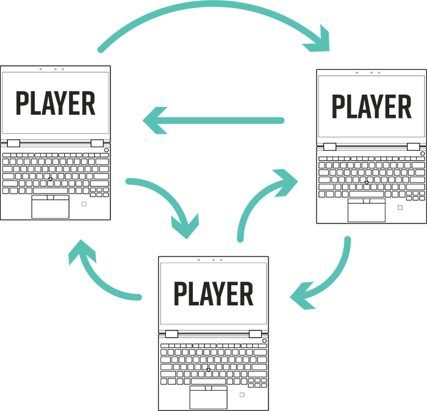
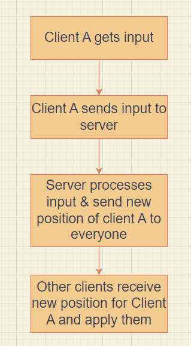

<h1><span className="text-primary-dark">.</span>Blog<span className="text-primary-dark">/</span>Reverse Engineering a Keyboard for OpenRGB<span className="text-primary-dark">/</span></h1>

# Introduction
So I recently bought the Darmoshark K5 mechanical keyboard, and it has per-key RGB lighting which is good but the provided software is very limited and I wanted more customizable effects.<br> 
I came across OpenRGB which is a free and open-source software that allows users to control RGB lighting on a variety of devices. 

Unfortunately, not all devices are supported. One solution is to to reverse engineer the device and add support for it myself. In this guide, I will walk through the process of reverse engineering my keyboard and how I added support for it.

# OpenRGB RGBController API
OpenRGB has its own API for supporting devices, this API can be broken down into three components which I had to build.
- The Detector
- The Controller
- The RGBController

## Building The Detector
> A device's Detector function scans the attached devices to see if a particular device (Controller/RGBController) exists.

So that was my first mission: Building the detector.

Well it's not really that hard in theory, the **REGISTER_DETECTOR** macros are used to register a detector function with the OpenRGB Resource Manager which is responsible for calling detector functions at detection time.
The problem was finding out which macro to use. Because some macros resulted in my keyboard getting detected as 6 different keybaords and some didn't detect it at all.

After some trial and error (and looking at the other already-supported devices and how they are doing it), this macro worked perfectly:

```cpp
REGISTER_HID_DETECTOR_PU("Darmoshark K5", DetectDarmosharkK5, DARMOSHARK_K5_VID, DARMOSHARK_K5_PID, 0xFF19, 0xFF19);
```

So let's break it down.
- The first argument is just the display name of the keyboard.
- The second one is the method to actually get the hid device, that method was included in the API docs example, I just used it as is.
- The third and fourth arguments are the VID (Vendor ID) and PID (Product ID) of the keyboard, so I had to figure those out by just opening the Device Manager and in the details tab for my keyboard they were both provided.
- The fifth and sixth arguments are the Page and Usage IDs, The Microsoft docs have [this](https://learn.microsoft.com/en-us/windows-hardware/drivers/hid/hid-usages#usage-id) table which lists the Usage IDs for different device types, the Usage ID for keyboards is 0x06. So why am I using this weird 0xFF19 that is not even listed in the table you ask?<br> 
Well when I tried 0x06 it resulted in my keyboard getting detected as four keyboards. 


So I checked the code for some of the supported keyboards and I found in some of them that magic 0xFF19 code that when I tried, it resulted in my keyboard getting detected once.

## Building The Controller
> A device's Controller class is a class that provides whatever functionality is necessary to communicate with a device. This class should implement functions to send > control packets to a device and receive information packets from a device. It should provide the capability to set device colors and modes.

Here is where the fun begins.

The plan is to understand how the keyboard's program sends the packets to my keyboard then emulate that same behaviour myself.

### Wireshark
> Wireshark is a free and open-source packet analyzer. It is used for network troubleshooting, analysis, software and communications protocol development, and education.

I opened Wireshark and began listening to the packets send to and received from the keyboard whenever I changed the RGB color using the provided software.


At first it was quite overwhelming, but eventually after analyzing the packets for some time, I noticed some specific packets that get sent and received every time I update the RGB colors.


### First Packet
First of all, it sends a specific packet at the beginning, I have no idea what that packet does, probably just prepares the keyboard to receive a new input or something.

Now let's analyze that packet so we can implement it in our overridden "SetLedsDirect" method in the Controller class.




So if you look at the section in the bottom left, we're only interested in the last two lines: the "wLength" and the "Data Fragment".
The wLength is just the length of the packet which is 64, and the data fragment is the actual data being sent so as you can see on the right section the first two bits are 0x08 and 0x21 then the rest are just zeros.<br>
So in code, that's how it should look like:

```cpp
// No idea what this is but it's sent before every RGB packet
uint8_t thing[64] = { 0x08, 0x21 };
```

Then we can just write that packet like so:

```cpp
// Send "thing", whatever that may be
hid_write(dev, thing, 64);
```

### Second Packet
Next packet to send is the RGB buffer, that buffer contains RGB values for every key, let's analyze it.




The length of the packet is 267 and the data fragment being sent starts with 0x20 then it continues to include each of the R, G, and B channels, and for each single channel it has a value from 0x00 to 0xff for every key.
So if I set every key to red you can see the first channel which is the R channel of the packet is 0xff while the rest after it are zeros.<br>

Let's implement that after our first packet.
So the overridden method comes with the `colors` parameter which contains the colors you are required to set in the RGB packet, but before we can use that we need define each key bit in our packet, so we need to know which keys map to which bits, Fun!

So I turned off the LEDs and started turning them on one by one to see which bit in the RGB packet gets turned on and recorded which keys map to which bit, ordered by the bits in the packet:

```cpp
///  LCTRL  Z    C    F  SPACE  M  RALT  FN  RCTRL L_A  ??  WIN    X    V    G    B
//    00,  01,  02,  03,  04,  05,  06,  07,  08,  09,  10,  11,  12,  13,  14,  15,
///    J    ,   ?? RSHIFT D_A PGD  LALT   A    D    R    N    U    .    /    '  R_A
//    16,  17,  18,  19,  20,  21,  22,  23,  24,  25,  26,  27,  28,  29,  30,  31,
///   ?? LSHIFT  S    E    T    H    I    K    ;    [  U_A   ??  CAPS   Q    3    4
//    32,  33,  34,  35,  36,  37,  38,  39,  40,  41,  42,  43,  44,  45,  46,  47,
///    Y    8    L    P    ] ENTER  PGU  TAB   W   ??    5    6    9    0    -    =
//    48,  49,  50,  51,  52,  53,  54,  55,  56,  57,  58,  59,  60,  61,  62,  63,
///    \   ??    `   ??   ??
//    64,  65,  66,  67,  68
```

As you can see there are some question marks here, for some reason there were bits that just never got turned on so they don't seem to map to any key.

Now I need to construct an array of those indices but order them by keys instead of bits (So it starts with the Esc key, 0, 1, 2, and so on..):

```cpp
#define NP 0xFF

static uint8_t packet_map[75] =
{
    77,  67,  78,  46,  47,  58,  59,  70,  49,  60,  72,  62,  63,  86, 66,
    55,  45,  56,  35,  25,  36,  48,  27,  38,  61,  51,  41,  52,  64, 75,
    44,  23,  34,  24,   3,  14,  37,  16,  39,  50,  40,  30,  53,  10, 54,
    33,   1,  12,   2,  13,  15,  26,   5,  17,  28,  29,  19,  NP,  42, 21,
    00,  11,  22,  NP,  NP,   4,  NP,  NP,  NP,   6,   7,   8,   9,  20, 31
};
```

Now I could finally send the RGB packet like so:

```cpp
uint8_t RGBbuffer[267] = { 0x20 };

for(int i = 0; i < colors.size(); i++) {
	RGBColor key = colors[i];
	uint16_t offset = packet_map[i];

	// Skipping unused keys
	if (offset == NP)
		continue;

	RGBbuffer[1 + offset] = RGBGetRValue(key);
	RGBbuffer[89 + offset] = RGBGetGValue(key);
	RGBbuffer[177 + offset] = RGBGetBValue(key);
}

hid_send_feature_report(dev, RGBbuffer, 267);
```

That packet is different from the first packet, it is a SET_REPORT Request, the first one is also marked as SET_REPORT Request on Wireshark but when I tried to send the first packet as a SET_REPORT Request it didn't work.<br>
So for that packet I used the method `hid_send_feature_report` instead of `hid_write`.<br>
Feature reports use the first bit of the data fragment as the ReportID, so as you can see I initialize the RGBbuffer with 0x20 which is the ReportID of that packet.

### Third Packet
Next packet I also have no idea about, but it always gets sent right after the RGB packet and it looks like this:


The length is 8, it is a GET_REPORT Request, and it has a ReportID of 22.

```cpp
uint8_t thing2[9] = { 22, 0xa1, 0x01, 0x16, 0x03, 0x00, 0x00, 0x02, 0x00 };

hid_get_feature_report(dev, thing2, 8);
```

### Forth Packet


The forth packet is identical to the first one except for the second and fifth bits, so I just change those bits in the same buffer and send it.

```cpp
// Edit things to be other things
thing[1] = 0x22;
thing[4] = 0x02;

// Send new things
hid_write(dev, thing, 64);
```

### Fifth Packet


The fifth and final packet looks like this:

```cpp
uint8_t thing3[9] = { 19, 0xa1, 0x01, 0x13, 0x03, 0x00, 0x00, 0x11, 0x01 };
hid_get_feature_report(dev, thing3, 8);
```

## Building The RGBController
> OpenRGB uses an internal API called RGBController to standardize the interface to RGB devices from multiple vendors and categories.
>
> The RGBController class specification contains the following:
> - Device Name
> - Device Description
> - Device Version
> - Device Serial
> - Device Location
> - Vector of LEDs
> - Vector of Zones
> - Vector of Modes
> - Vector of Colors (32-bit 0x00BBGGRR format)
> - Device Type (enum)
> - Active mode index

It's pretty straightforward, I just yoinked the code of some other supported keyboard and began editing it.<br>
I needed first to define a matrix map for the keys in order, including "unused keys" which are for keys bigger than one square like the space bar.

```cpp
#define NA  0xFFFFFFFF

static unsigned int matrix_map[5][15] =
{
	{ 0,    1,  2,  3,  4,  5,  6,  7,  8,  9, 10, 11, 12, 13, 14},
	{ 15,  16, 17, 18, 19, 20, 21, 22, 23, 24, 25, 26, 27, 28, 29},
	{ 30,  31, 32, 33, 34, 35, 36, 37, 38, 39, 40, 41, 42, NA, 44},
	{ 45,  46, 47, 48, 49, 50, 51, 52, 53, 54, 55, 56, NA, 58, 59},
	{ 60,  61, 62, NA, NA, 65, NA, NA, NA, 69, 70, 71, 72, 73, 74}
};
```

I also needed to define the key names in the order of that matrix, like so:

```cpp
static const char *led_names[] =
{
/*00*/    KEY_EN_ESCAPE,
/*01*/    KEY_EN_1,
/*02*/    KEY_EN_2,
/*03*/    KEY_EN_3,
/*04*/    KEY_EN_4,
/*05*/    KEY_EN_5,
/*06*/    KEY_EN_6,
/*07*/    KEY_EN_7,
/*08*/    KEY_EN_8,
/*09*/    KEY_EN_9,
/*10*/    KEY_EN_0,
/*11*/    KEY_EN_MINUS,
/*12*/    KEY_EN_EQUALS,
/*13*/    KEY_EN_BACKSPACE,
/*14*/    KEY_EN_BACK_TICK,
.
.
.
}
```

In the constructor of that class I needed to provide some information:

```cpp
name                        = "Darmoshark K5 Keyboard";
vendor                      = "Darmoshark";
type                        = DEVICE_TYPE_KEYBOARD;
description                 = controller->GetDeviceName();
serial                      = controller->GetSerial();
location                    = controller->GetLocation();
```

That's about it, everything else is the same as the yoinked code from the other keyboard.

# Summary
So yeah that was my first experience with reverse engineering and using Wireshark, I learnt a lot.